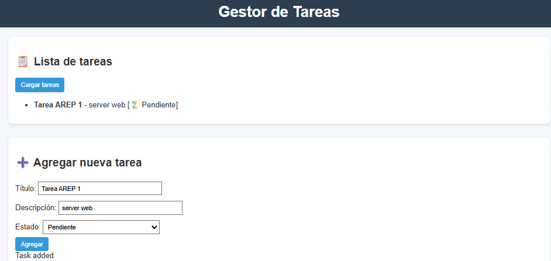
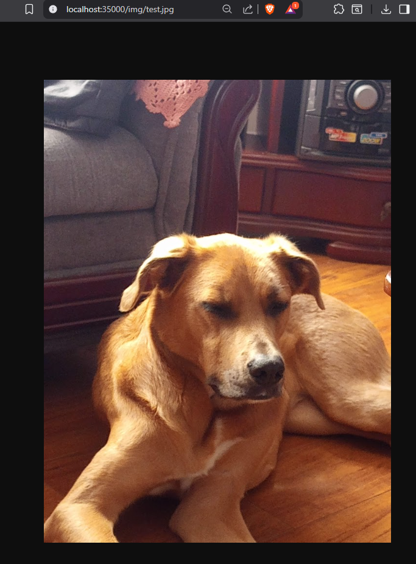
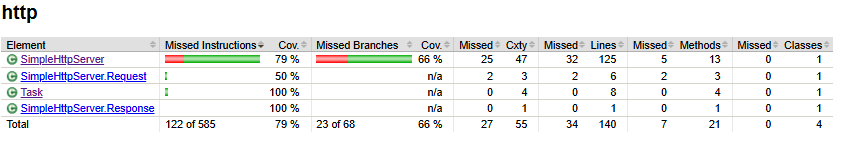

# Framework Web para Servicios REST y Gestión de Archivos Estáticos

Framework web en Java para el desarrollo de aplicaciones con servicios REST backend y gestión de archivos estáticos.

## Características Principales

* Definición de servicios REST mediante funciones lambda
* Manejo de valores de consulta en peticiones
* Especificación flexible de ubicación de archivos estáticos
* Soporte para archivos HTML, JavaScript, CSS e imágenes

### Prerequisitos

* Java 8 o superior
* Maven
* Browser

## Instalación y Ejecución

1. Clona el repositorio
   ```
    git clone https://github.com/DavidBarbosag/tallerDisenoEstructuracionAplicacionesInternet.git
   ```

2. Entra al directorio del proyecto
3. Compila el proyecto con Maven
   ```
     mvn clean package
   ```
4. Ejecuta el servidor
  ```
    java -cp target/http-mini-server-1.0-SNAPSHOT.jar http.SimpleHttpServer
  ```
5. Accede mediante este url http://localhost:35000.

6. Uso del Microframework

   El servidor implementa un microframework sencillo inspirado en frameworks web populares. Permite:
   
   Definir rutas GET con funciones lambda.
   
   ```
   SimpleHttpServer.get("/App/hello", (req, res) -> "Hello " + req.getValues("name"));
   SimpleHttpServer.get("/App/pi", (req, res) -> String.valueOf(Math.PI));
   ```
   
   * req permite acceder a parámetros de la URL (req.getValues("name")).
   
   * res es un objeto de respuesta (en este caso no se usa, pero está disponible para extender).
   
   Ejemplo de uso en el navegador:
   
   http://localhost:35000/App/hello?name=David
   
   
   → Respuesta: Hello David
   
   http://localhost:35000/App/pi
   
   
   → Respuesta: 3.141592653589793


## Estructura del proyecto

```
http-mini-server/
├── assets/                          # Imágenes y recursos estáticos para la documentación
│   ├── exampleStaticFiles.png
│   ├── img.png
│   └── taskSended.png
│
├── public/                          # Archivos estáticos servidos por el servidor
│   ├── index.html
│   ├── style.css
│   ├── app.js
│   └── img/
│       └── test.jpg
│
├── src/
│   ├── main/
│   │   └── java/
│   │       └── http/
│   │           ├── SimpleHttpServer.java
│   │           └── Task.java
│   │
│   └── test/
│       └── java/
│           └── http/
│               └── AppTest.java
│
├── pom.xml                          # Archivo de configuración de Maven
└── README.md                        # Documentación del proyecto
```

## Arquitectura

El framework está construido sobre los siguientes componentes:


* Servidor principal (SimpleHttpServer.java):

   Gestiona las conexiones entrantes, sirve archivos estáticos desde la carpeta public/ y expone una API REST para la gestión de tareas.


* Modelo de datos (Task.java):

   Representa las tareas gestionadas por la API, permitiendo operaciones de consulta y creación.


* Recursos estáticos:

   Los archivos HTML, CSS, JS e imágenes se encuentran en la carpeta public/ y son servidos directamente por el servidor.

  
El flujo básico consiste en recibir una solicitud HTTP, identificar si es para un recurso estático o para la API,
y responder en consecuencia. La comunicación entre módulos se realiza mediante clases Java simples, facilitando la extensión
y el mantenimiento.

## Uso

* Para ver la página principal:
http://localhost:35000/


* Al agregar una tarea, se muestran en la lista de tareas.



* Para consultar las tareas (API):
http://localhost:35000/api/tasks

* Para mostrar los archivos estáticos:
http://localhost:35000/<ruta_del_archivo>
    (Muestra el contenido del archivo si existe).



## Análisis estático




## Autor
David Alfonso Barbosa Gómez

   
